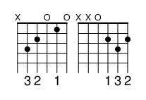

A small collection of programs, almost all terminal/command line/text based, that work with 
music notes/chords/etc (currently Western/English music using the 12-note scale, etc.) in various ways.
Tested/works on an M1 mac, at least, should mostly work with other OSs, but YMMV.

*** How to use the little programs is below the installation instructions ***

An effort is made to make the various programs -

- do one thing. Not many things.
- read from stdin or arguments on the command line
- pipe-able to each other (e.g. foo | bar | baz)  At least, in theory.

Included are text based chord-to-note, note-to-chord, pitch shifting, intervals, juxtaposing chords, finding the longest
repeating run of chords in a song, etc.  Also has a little utility to create guitar fingering PNGs from chords and a simple
chord/music player.

Mostly written for myself while learning guitar (next to buying new gear, writing programs about music has to rank up
there in the grand scheme of avoiding actual learning) to help learn some of the really crazy things I'd memorize if I 
went to music school. But I was asked by a few friends to put it out, so... ignore, use, or whatever as you will.

Heavily relies on Python and the [mingus](https://github.com/bspaans/python-mingus) and
[music21](https://github.com/cuthbertLab/music21) libraries (started with the former, but while I love the approach it
seems rather dead, and music21 - while a bit opaque at times - is more impressive and growing.)

### Install/requirements

You can install the basic requirements via -
```
    pip3 install -r requirements.txt
```
Or simply -
```
    pip3 install mingus==0.6.1 colorama==0.4.6 music21==9.7.0
```
Some programs require lilipond, imagemagick, and fluidsynth; on a mac the easiest way to get this installed is via homebrew (a package manager that makes everything much easier) - if you don't have it, try:
```
ruby -e "$(curl -fsSL https://raw.github.com/mxcl/homebrew/go/install)"
```
Then you can install lilipond, imagemagick, and fluidsynth by simply -
```
homebrew install lilypond imagemagick fluidsynth
```
(Or you can go to https://lilypond.org/, https://imagemagick.org/, and https://github.com/FluidSynth/fluidsynth/wiki/Download, and install from their respective sites.)

## programs

### n2c

``n2c`` - AKA notes-to-chords. Takes a set of notes (from stdin or arguments) and attempts to convert them to chords.

Errors and some surpurfluous data are sent to /dev/stderr, the rest goes to stdout.

```bash
$ echo  B D# F# | n2c
BM
$ n2c C Eb G
...it might be one of...
Cm
EbM6
```

### c2n

``c2n`` - AKA chords-to-notes. Takes a set of chords (from stdin or arguments) and attempts to convert them to notes.

Errors and some surpurfluous data are sent to /dev/stderr, the rest goes to stdout.
```bash
$ echo  B D# F# | n2c
BM
```
Since it can read from stdin, you can also do something like -
```bash
# note - the "BM" in the output was sent to stderr... this is for legibility but also permits easier piping
$ echo  B D# F# | n2c | c2n
BM         B D# F#
```
Or, conversely -
```bash
$ echo  C | c2n | n2c
C          CM
```

### pitch_shift

``pitch_shift.py`` - takes a set of notes/chords (from stdin or arguments) and attempts to shift their pitch
by +- the pitches specified. Pitch is the first argument. Assumes 4th octave if none explicitly specified.

```bash
$ pitch_shift.py 2 A
B-4
```

```bash
$ pitch_shift.py 2 A-5
B-6
```

```bash
$ pitch_shift.py -2 D
C-4
```

Since it can read from stdin, you can also do something like -
```bash
$ pitch_shift.py 3 A B C | pitch_shift.py -3
A-4 B-4 C-4
```

### intervalz

``intervals.py`` - in some sense similar to the pitch shifter above, this takes a *set of pairs* made up of notes and intervals, and
outputs whatever the results are, one per line. The notes are upper/lower case A-G (plus sharps/flats), and the
intervals can either be the number of half steps or the shortcuts listed below (if you give the program a ``-h`` or
``--help`` argument it'll dump all this out -

```
    Half Steps   Interval Name                                  Shortcut
         1       Minor Second                                      m2
         2       Major Second                                      M2
         3       Minor Third                                       m3
         4       Major Third                                       M3
         5       Perfect Fourth                                    P4
         6       Tritone/Augmented Fourth/Diminished Fifth     tri/A4/d5
         7       Perfect Fifth                                     P5
         8       Minor Sixth                                       m6
         9       Major Sixth                                       M6
         10      Minor Seventh                                     m7
         11      Major Seventh                                     M7
```
*** Bug - currently I don't track octaves, need to add... this is to try and save me from calculating perfect fifths for a buncha notes in a row ***

So you might do -
```bash
./intervalz.py C P4
The Perfect Fourth of C is F
```
or -
```bash
./intervalz.py C m6 D m3
The Minor Sixth of C is A
The Minor Third of D is F#
```
Etcetera.

### juxtachord

```
jux·ta·pose
/ˈjəkstəˌpōz,ˌjəkstəˈpōz/
verb
place or deal with close together for contrasting effect.
"black-and-white photos of slums were starkly juxtaposed with color images"
```
Simarly, <tt>juxtachord</tt> takes 2 or more chords and lays them out to illustrate their commonalities or differences.

For example -

```bash
$ juxtachords.py D7 D
```


More chords can be added to help see variations notes in a piece of a song, or... here's the beginning
of the Beatle's Help! song -

```bash
$ juxtachords.py Bm Bm/A G G/F# E A A C#m F#m D G A
```


To me it's fun to see variety and commonalities... perhaps someone with music training could easily
pick out all the sharps and notes, but not me. Who knows what notes are shared between D7, C5, and F#?
Not me, certainly!

### chords2png.sh

``chords2png.sh`` creates little PNGs image files of guitar chord fingering.
```bash
$ chords2png c
rendered image is in:

    c.png

```
Multiple chords may be created, just space-separate them -
```bash
./chords2png.sh c7 d6
rendered image is in:

    c7 d6.png
```
You can view this with any image viewer (those using `iterm2` can use the awesome `imgcat` to do in-line terminal viewing.)
<br />
<br />



### play_chords.py

(Requires fluidsynth, a software based synthesizer.)

Command line tool that plays a stream* of notes in the order given.

* literally implemented as a music21 stream.

```bash
# play a C7 chord followed by a D minor chord
./play_chords.py bpm=160 C7 Dm
```

Many options, some below. Note - this was never meant to be anything approaching the full expressiveness of music, it's
a very simple thing that'll play a few chords or notes in a row. I find it useful when I see someone talking about
a handful of notes in a row and I want to hear what they sound like, such as -

    C7 B5 Db

Command line behavior - if it sees (and many more types of chords - check out [chords.md](chords.md)) -

    The letters A-G, that's a chord. If prepended with an underscore, play a note, else play a chord. Can have a wide variety of suffixes, such as:

            C7
            Db#
            Fm6


    This uses music21's "harmony.ChordSymbol" function to try and recognize the chord in question. More can
    be found at -

        https://www.music21.org/music21docs/moduleReference/moduleHarmony.html
        https://www.music21.org/music21docs/moduleReference/moduleChord.html#music21.chord.Chord

    I added the "X" character, which signifies a rest. 

    In addition, if you add a period (".") followed by a fraction or a recognized spelling of the same, it'll try to play that - e.g.

        C.1/2       half note
        C.1/8       eighth note
        C.quarter   quarter note
        X.1         whole rest

        etc.

    Also (be sure to put these before notes that you want impacted by them!) -

        bpm=X - set the BPM to the value (only impacts notes after this is set! Default is 120bpm.)

        ts=A/B - set the time signature to whatever.

        clef=foo - set the clef to... treble, bass, whatever.


    If you modify the code (e.g. set "PRINT_SCORE=True" - I know, I know, I need a flag) and you have 
    [MusicScore](https://musescore.com/) installed, music21 tries to funnel the notes you specified into
    MusicScore's UI.


### xtab.sh

``xtab.sh`` attempts to extract notes from a TAB page.

It's simply a grep that looks for note-looking-things, but it might be useful for ``ripMax`` (see the next tool.)

```bash
$ cat xtab.sh
egrep -w -o '[CDEFGAB](b|bb)?(m|maj7|maj|min7|min|sus)?(1|2|3|4|5|6|7|8|9)?(#)?(/[CDEFGAB])?(b|bb)?(m|maj7|maj|min7|min|sus)?(1|2|3|4|5|6|7|8|9)?(#)?' "$1" | tr '\n' ' '
echo
```

### ripMax
``ripMax`` attempts to find the longest sequence of notes that it can find in a set of chords.

This will be used later when discovering efficient alternate guitar tunings, but I think it's interesting in its own right to see what sections of a song are repeated.

``ripMax`` takes a file as an argument that should have chords separated by whitespace (e.g. spaces, tabs, newlines, etc.)

It requires at least 6 in a run (variable "MIN_LENGTH"), and the maximum sequence can't be more than N/2 chords, where N is the number of chords in the file.

Here's an example run for a popular song -
```bash
# purportedly the chords to the Beatle's song "Help!"
$ cat chords.txt
Bm Bm/A G G/F# E A A C#m F#m D G A C#m F#m D G A Bm Bm/A G G/F# E A Bm Bm/A G G/F# E A A C#m F#m D G A C#m F#m D G A Bm Bm/A G G/F# E A F#m A A6 C#m F#m D G A C#m F#m D G A Bm Bm/A G

$ ./ripMax.py help.txt
working with 62 chords (10 unique):
Bm Bm/A G G/F# E A A C#m F#m D G A C#m F#m D G A Bm Bm/A G G/F# E A Bm Bm/A G G/F# E A A C#m F#m D G A C#m F#m D G A Bm Bm/A G G/F# E A F#m A A6 C#m F#m D G A C#m F#m D G A Bm Bm/A G

N-in-seq    N-times     Group of Chords
23  2   Bm Bm/A G G/F# E A A C#m F#m D G A C#m F#m D G A Bm Bm/A G G/F# E A

FINAL RUN:

Bm Bm/A G G/F# E A A C#m F#m D G A C#m F#m D G A Bm Bm/A G G/F# E A

Bm Bm/A G G/F# E A A C#m F#m D G A C#m F#m D G A Bm Bm/A G G/F# E A
F#m A A6 C#m F#m D G A C#m F#m D G A Bm Bm/A G
```

