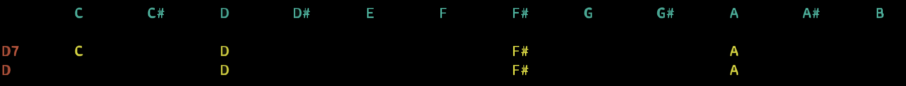

And so it begins....

This is a set of programs that work with music notes/chords/etc in various ways.

An effort is made to make the various programs -

- do one thing
- read from stdin or arguments on the command line
- pipe-able to each other (e.g. foo | bar | baz)

## Install/requirements

It's fairly reliant on the mingus music package. You can install via -
```
    pip3 install -r requirements.txt
```
Or simply -
```
    pip3 install mingus==0.6.1
```

## programs

### n2c

``n2c`` - AKA notes-to-chords. Takes a set of notes (from stdin or arguments) and attempts to convert them to chords.

Errors and some surpurfluous data are sent to /dev/stderr, the rest goes to stdout.

```bash
$ echo  B D# F# | n2c
BM
$ n2c C Eb G
...it might be one of...
Cm
EbM6
```

### c2n

``c2n`` - AKA chords-to-notes. Takes a set of chords (from stdin or arguments) and attempts to convert them to notes.

Errors and some surpurfluous data are sent to /dev/stderr, the rest goes to stdout.
```bash
$ echo  B D# F# | n2c
BM
```
Since it can read from stdin, you can also do something like -
```bash
# note - the "BM" in the output was sent to stderr... this is for legibility but also permits easier piping
$ echo  B D# F# | n2c | c2n
BM         B D# F#
```
Or, conversely -
```bash
$ echo  C | c2n | n2c
C          CM
```

### pitch_shift

``pitch_shift.py`` - takes a set of notes/chords (from stdin or arguments) and attempts to shift their pitch
by +- the pitches specified. Pitch is the first argument. Assumes 4th octave if none explicitly specified.

```bash
$ pitch_shift.py 2 A
B-4
```

```bash
$ pitch_shift.py 2 A-5
B-6
```

```bash
$ pitch_shift.py -2 D
C-4
```

Since it can read from stdin, you can also do something like -
```bash
$ pitch_shift.py 3 A B C | pitch_shift.py -3
A-4 B-4 C-4
```

### xtab.sh

``xtab.sh`` attempts to extract notes from a TAB page.

It's simply a grep that looks for note-looking-things, but it might be useful for ``ripMax`` (see the next tool.)

```bash
$ cat xtab.sh
egrep -w -o '[CDEFGAB](b|bb)?(m|maj7|maj|min7|min|sus)?(1|2|3|4|5|6|7|8|9)?(#)?(/[CDEFGAB])?(b|bb)?(m|maj7|maj|min7|min|sus)?(1|2|3|4|5|6|7|8|9)?(#)?' "$1" | tr '\n' ' '
echo
```

### juxtachord

```
jux·ta·pose
/ˈjəkstəˌpōz,ˌjəkstəˈpōz/
verb
place or deal with close together for contrasting effect.
"black-and-white photos of slums were starkly juxtaposed with color images"
```
Simarly, <tt>juxtachord</tt> takes 2 or more chords and lays them out to illustrate their commonalities or differences.

For example -

```bash
$ juxtachords D7 D
        C       C#      D       D#      E       F       F#      G       G#      A       A#      B

D7      C               D                               F#                      A
D                       D                               F#                      A
```




More chords can be added to help see variations notes in a piece of a song, or... here's the beginning
of the Beatle's Help! song -

    $ juxtachords Bm Bm/A G G/F# E A A C#m F#m D G A
            C       C#      D       D#      E       F       F#      G       G#      A       A#      B

    Bm                      D                               F#                                      B
    Bm/A                    D                               F#                      A               B
    G                       D                                       G                               B
    G/F#                    D                               F#      G                               B
    E                                       E                               G#                      B
    A               C#                      E                                       A
    A               C#                      E                                       A
    C#m             C#                      E                               G#
    F#m             C#                                      F#                      A
    D                       D                               F#                      A
    G                       D                                       G                               B
    A               C#                      E                                       A


To me it's fun to see variety and commonalities... perhaps someone with music training could easily
pick out all the sharps and notes, but not me.

### ripMax

(Note - this doesn't use stdin/stderr)

``ripMax`` attempts to find the longest sequence of notes that it can find in a set of chords.

This will be used later when discovering efficient alternate guitar tunings, but I think it's interesting in its own right to see what sections of a song are repeated.

``ripMax`` takes a file as an argument that should have chords separated by whitespace (e.g. spaces, tabs, newlines, etc.)

It requires at least 6 in a run (variable "MIN_LENGTH"), and the maximum sequence can't be more than N/2 chords, where N is the number of chords in the file.

It will write the final results in a file with the same filename plus the suffix ".max".

Here's an example run for a popular song -
```bash
# purportedly the chords to the Beatle's song "Help!"
$ cat chords.txt
Bm Bm/A G G/F# E A A C#m F#m D G A C#m F#m D G A Bm Bm/A G G/F# E A Bm Bm/A G G/F# E A A C#m F#m D G A C#m F#m D G A Bm Bm/A G G/F# E A F#m A A6 C#m F#m D G A C#m F#m D G A Bm Bm/A G

$ ./ripMax.py help.txt
working with 62 chords (10 unique):
Bm Bm/A G G/F# E A A C#m F#m D G A C#m F#m D G A Bm Bm/A G G/F# E A Bm Bm/A G G/F# E A A C#m F#m D G A C#m F#m D G A Bm Bm/A G G/F# E A F#m A A6 C#m F#m D G A C#m F#m D G A Bm Bm/A G

N-in-seq    N-times     Group of Chords
23  2   Bm Bm/A G G/F# E A A C#m F#m D G A C#m F#m D G A Bm Bm/A G G/F# E A

FINAL RUN:

Bm Bm/A G G/F# E A A C#m F#m D G A C#m F#m D G A Bm Bm/A G G/F# E A

Bm Bm/A G G/F# E A A C#m F#m D G A C#m F#m D G A Bm Bm/A G G/F# E A
F#m A A6 C#m F#m D G A C#m F#m D G A Bm Bm/A G

... also writtten to help.max
```


    R e d
$${\color{green}Green}$$    G r e e n
$${\color{lightgreen}Light \space Green}$$  L i g h t G r e e n

